# Slac + Zapier + Honeycode Integration example

## Table of Contents 

[1. Overview](#overview)

[2. Instantiate "Simple To-Do" template in Honeycode](#instantiate-simple-to-do-template-in-honeycode)

[3. Short overview on Triggers, Actions and Webhooks](#short-overview-on-triggers-actions-and-webhooks)

[4. Use Zapier to Integrate Slack and Honeycode](#use-zapier-to-integrate-slack-and-honeycode)

[5. Testing the Slack to Honeycode integration](#testing-the-slack-to-honeycode-integration)

## Overview

Amazon Honeycode is a fully managed service for customers to quickly
build powerful mobile and web applications with no programming required.
It helps solve team sized collaboration, and process improvement
challenges without any coding.

In this lab you will learn one way to connect your Honeycode with other
data and apps via Zapier. Specifically your Honeycode "Simple TODO" app
will receive TODO items from Slack. This is extremely useful if you want
to collect all your TODO items in one place, for example. This simple
example shows how to send data into Honeycode with Zapier. You can also
use a Web Hook in Zapier to pull data out of Honeycode and send it to
another target. Additionally, Honeycode offers AppFlow and Native APIs
for connecting your Honeycode workbook with other data sources and
applications.

The goal for these labs is to:

-   Create two apps, one for a team member to track their tasks and
    another for the manager to track their team's tasks.

-   Send automatic reminders and alerts to team members.

Pre-requisites:

1.  Free tier, Honeycode account. For the purposes of this Lab a Single
    Sign On (SSO) based account will not work, you should use a private
    email address to setup a Honeycode account. Use this URL to create a
    Honeycode account: <https://builder.honeycode.aws/auth/signup>

2.  Free trial, Slack account. For the purposes of this Lab you do not
    need to add any other team members to your Slack account. Use this
    URL to create a Slack account: <https://slack.com/get-started#/>

3.  Zapier account. This s the account where you will setup the
    integration between Slack and Honeycode. Use this URL to create a
    Zapier account: <https://zapier.com/sign-up/>

Format Conventions:

**Create Account**: Actions in the screen, like buttons or toolbar
elements.

My Drive: references to text or non-actionable elements in your screen.

"Tasks": reference to text that the user has to input in the screen.

FILTER: Inline code, keywords or formulas.

# Lab 6: Slack + Zapier + Honeycode

In this lab you will connect Slack with the Simple TODO app in Honeycode
using Zapier. You will be able to take any message sent in Slack and add
it in a central place where you track your TODO items. This shows a
basic integration, through Zapier, but this topic is vast; we encourage
you to try it out and go exploring.

This lab will assume that you have the pre requisites and in this
account we will use <honeycode01@danieltet.com> as the sample email with
accounts in both Honeycode and Slack.

## Instantiate "Simple To-Do" template in Honeycode 

Instead of creating a Honeycode application from scratch we will use the
Simple ToDo template and add new tasks in this workbook from Slack.
Using the template, rather than creating an app from scratch, is
intended to save time during the lab.

1.  Log into your Honeycode (non SSO) account

2.  From "My Drive" click on "Create Workbook" button in the top right
    of the screen

3.  Choose "Simple To-Do" template

4.  Click Create

> 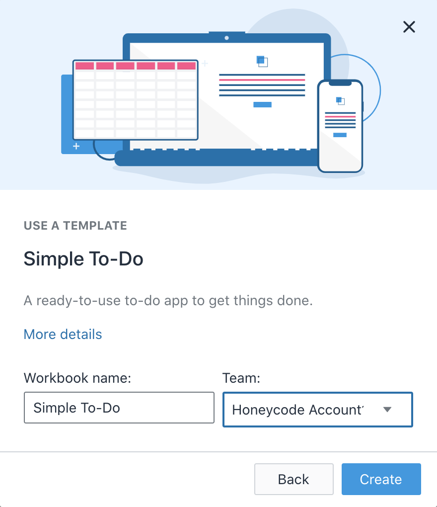{width="1.6270330271216098in"
> height="1.8859645669291338in"}

Once you've created the Workbook and the App you can move to the next
step. We will revisit the Tasks table in a later step to ensure the
tasks from Slack makes its way into this table.


## Short overview on Triggers, Actions and Webhooks

A Zap is a workflow within Zapier that can connect two or more apps. A
Trigger initiates an action (or Zap in Zapier terms). An "Action"
```
+----------------+----------------+----------------+----------------+
|                | Honeycode in   | Zapier itself  | Other          |
|                | Zapier         |                | third-party    |
|                |                |                | applications   |
|                |                |                | in Zapier      |
+================+================+================+================+
| **Triggers**   | Currently      | Zapier also    | You can choose |
|                | Honeycode      | offers many    | triggers from  |
| -   Initiate   | cannot be a    | built in       | many           |
|     execution  | trigger, but   | triggers like  | third-party    |
|     of a Zap   | Honeycode can  | Schedule by    | apps within    |
|     (workflow) | call a         | Zapier or      | Zapier. For    |
|     in Zapier  | "Webhook by    | Email by       | example Slack  |
|                | Zapier" with   | Zapier.        | will trigger a |
|                | some data to   |                | zap when a new |
|                | start a zap.   |                | public message |
|                |                |                | is posted.     |
+----------------+----------------+----------------+----------------+
| **Actions**    | { | helper         | party          |
| -              | width="1.06140 | Actions, for   | Applications   |
|   Applications | 31058617672in" | example:       | can serve as   |
|     offer      | he             | Paths, Filter, | actions, and   |
|                | ight="0.658070 | Formatter.     | have specific  |
|   capabilities | 8661417323in"} |                | capabilities.  |
|     within     |                |                | For example:   |
|     Zapier     | Allows you to  |                | Amazon S3      |
|                | add, delete    |                | Application,   |
|                | and update     |                | allows you to  |
|                | rows, as well  |                | create a       |
|                | as search for  |                | bucket and     |
|                | rows in        |                | upload a file. |
|                | Honeycode.     |                |                |
+----------------+----------------+----------------+----------------+
| **Webhooks**   | Honeycode can  | Webhooks by    | Other          |
|                | trigger (call) | Zapier App can | applications   |
| -   HTTP       | a Zapier       | call other     | can receive    |
|     Endpoints  | webhook and    | webhooks via   | webhook        |
|     for        | send data;     | GET, POST, PUT | c              |
|     sending    | Zapier takes   | or a custom    | alls/messages. |
|     messages   | the data and   | request.       | For example    |
|     between    | passes it to   |                | Pdf4Me can     |
|     apps       | subsequent     |                | receive data   |
|                | actions in a   |                | via a webhook. |
|                | specific zap.  |                |                |
|                | Honeycode      |                |                |
|                | cannot receive |                |                |
|                | webhook calls  |                |                |
|                | at this time.  |                |                |
+----------------+----------------+----------------+----------------+
```
You can read more about these Zapier concepts here:

-   <https://zapier.com/help/create/basics/learn-key-concepts-in-zapier>

-   <https://zapier.com/help/create/code-webhooks/trigger-zaps-from-webhooks>

## Use Zapier to Integrate Slack and Honeycode

In this section we will use Zapier to setup a Slack trigger, and a
Honeycode action; the overall effect will be that any specific message
from your Slack conversations will make its way into the "Simple To-Do"
Tasks table. The final Zap looks like this:

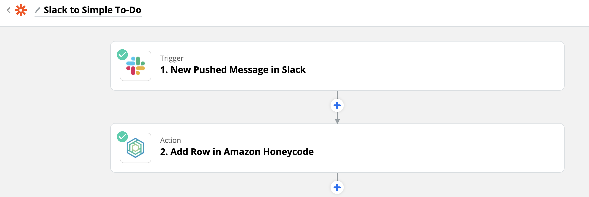{width="5.681598862642169in"
height="1.9050448381452318in"}

Here are the steps to follow

1.  Log into Zapier and click on "Make a Zap"\
    > \
    > {width="1.3436887576552932in"
    > height="0.2807020997375328in"}

2.  In the Trigger search for "Slack" and choose the icon with the
    > correct logo:\
    > \
    > 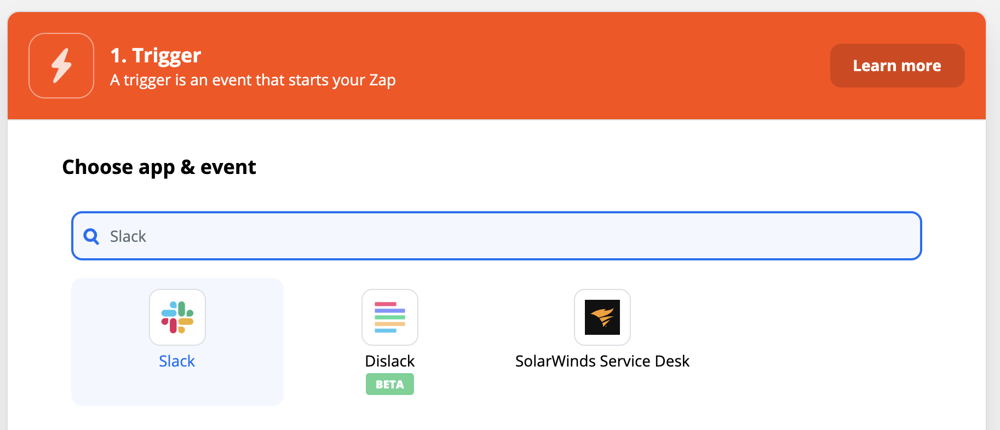{width="5.622807305336833in"
    > height="2.4202788713910763in"}

3.  For Trigger Event choose: "New Pushed Message"\
    > \
    > 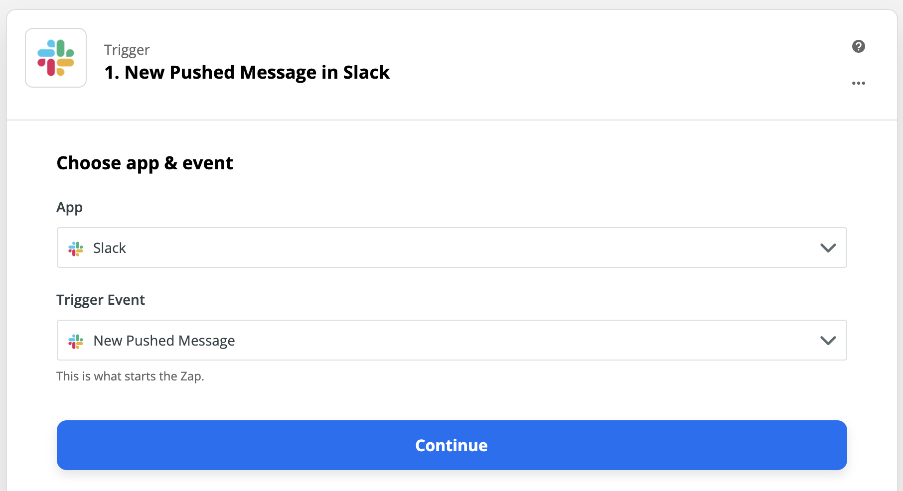{width="6.0in" height="3.2645833333333334in"}

4.  Click on "Continue" and choose the Slack account you will use. If
    > you have not setup a Slack account before you will click on "+
    > Connect a new account"\
    > \
    > 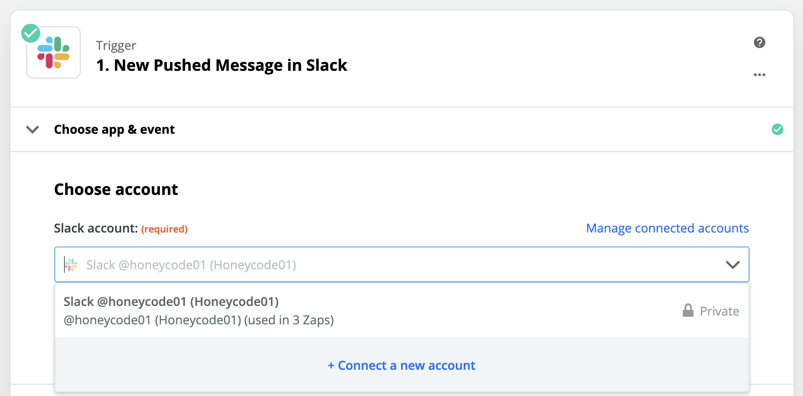{width="6.0in" height="2.967361111111111in"}\
    > \
    > and be asked to sign into Slack, and give Zapier permissions to
    > your Slack account like so:\
    > \
    > 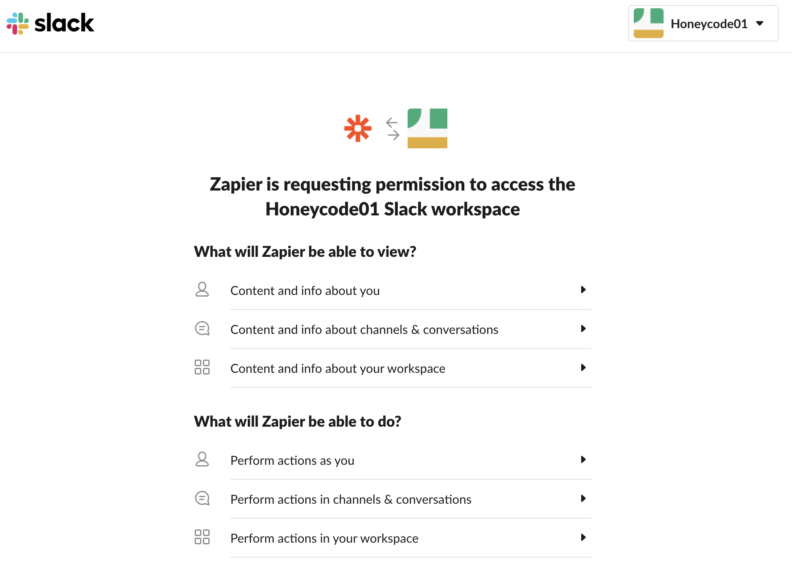{width="6.0in"
    > height="4.3180555555555555in"}\
    > \
    > Once you have signed into Slack and given Zapier permission to
    > your Slack account, as shown above, you will choose the account
    > for this new Zap, and click "Continue" to test the trigger.\
    > \
    > 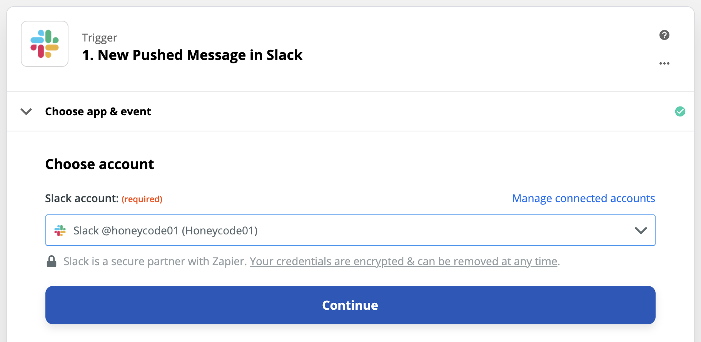{width="6.0in"
    > height="2.9305555555555554in"}

5.  Press the "Test" button to test the trigger, you should see a
    > success message like this. This will ensure Zapier and Slack are
    > connected.\
    > \
    > 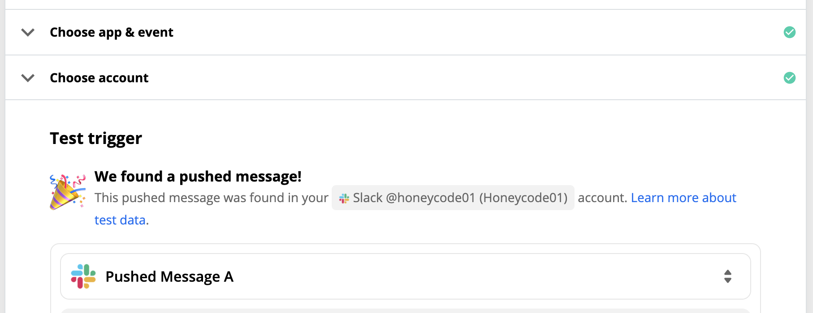{width="6.0in"
    > height="2.3152777777777778in"}

6.  In the Slack account you will now see a new App:\
    > \
    > 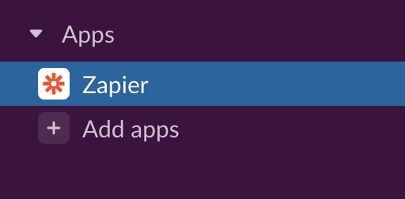{width="1.9473687664041994in"
    > height="0.9584700349956256in"}
    > 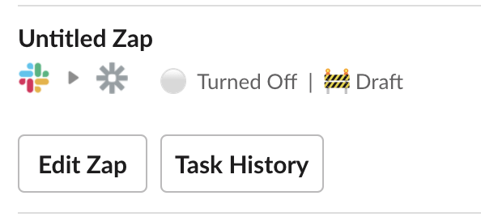{width="2.0964916885389324in"
    > height="0.9458923884514435in"}\
    > (**note**: Turned On will be gray at this point, since the Zap is
    > not turned on yet)

7.  Now, back in Zapier click the (+) icon and to add a Honeycode Action
    > to the Zap:\
    > \
    > 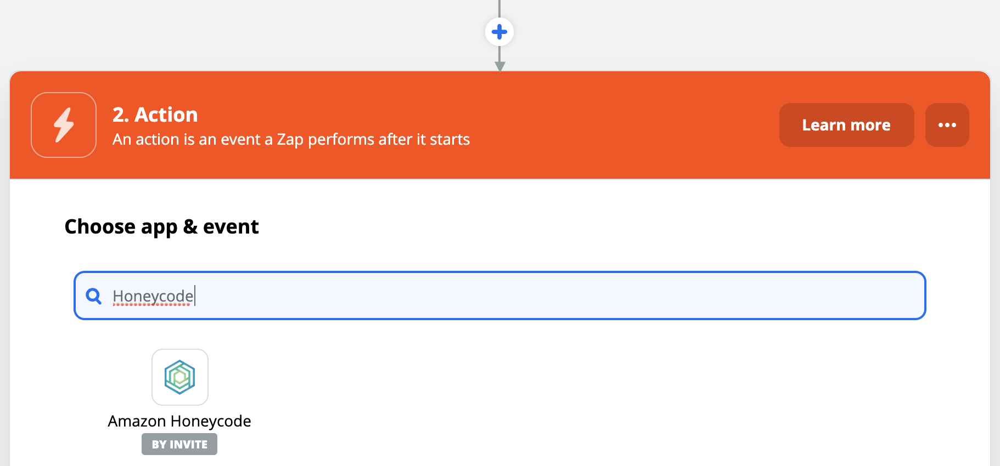{width="6.0in"
    > height="2.7993055555555557in"}

8.  Set "Action Event" to "Add Row" and click "Continue"

9.  Login or choose a Honeycode account and click "Continue":\
    > \
    > 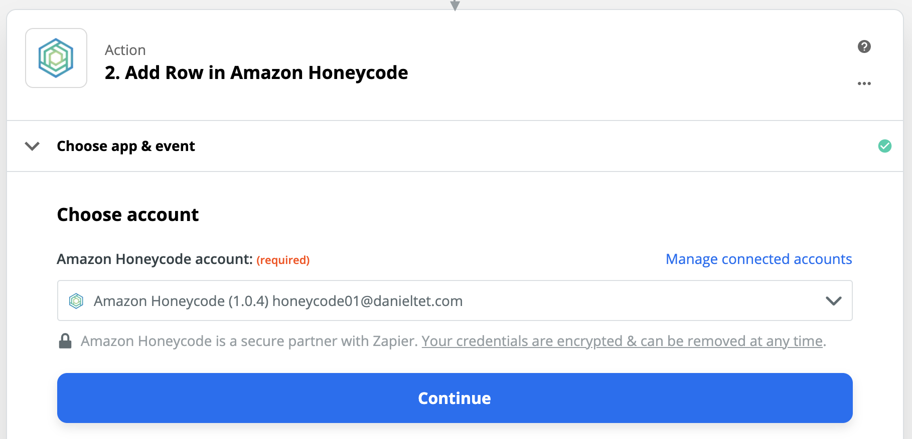{width="6.0in"
    > height="2.8979166666666667in"}\
    > \
    > This step is similar to the Slack login above, but this time use
    > the credentials from your Honeycode account.

10. Setup the action's workbook and table to: "Simple To-Do" and "Tasks"
    > respectively. Note: this workbook was created above from a
    > template.\
    > \
    > 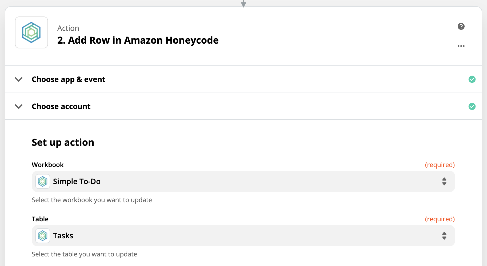{width="6.0in" height="3.286111111111111in"}

11. Set Task name to the sample data retrieved from Slack, specifically
    > to the "Message Text" like so:\
    > \
    > 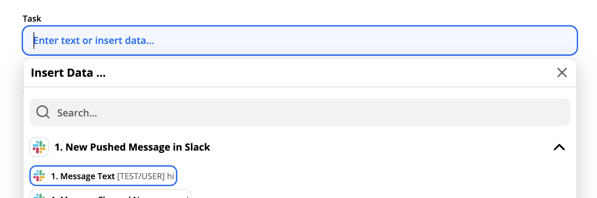{width="6.0in"
    > height="1.9930555555555556in"}\
    > \
    > Leave the rest of the columns/fields of the Tasks table empty, we
    > will only be passing along a message and storing it as the task
    > name in Honeycode.

12. Click "Test and Continue" and you should see a success message like
    > this:\
    > \
    > 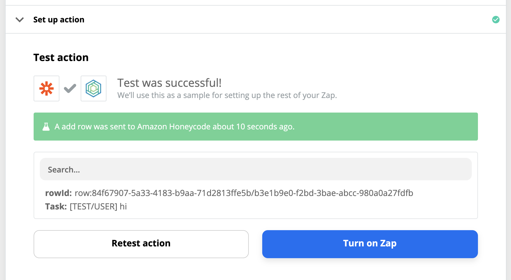{width="6.0in"
    > height="3.2895833333333333in"}

13. Before you are done, we recommend naming your Zap to something
    > memorable like: "Slack to Honeycode To-Do":\
    > \
    > 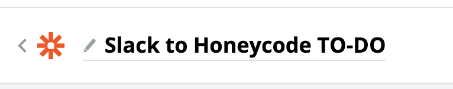{width="2.0334700349956254in"
    > height="0.40350831146106736in"}

14. Now click "Turn on Zap" and you are done with the configuration in
    > Zapier. Next we will test pushing a few messages from Zapier into
    > the Honeycode Tasks table. In Zapier and Slack you will see the
    > following success indicators respectively:\
    > \
    > 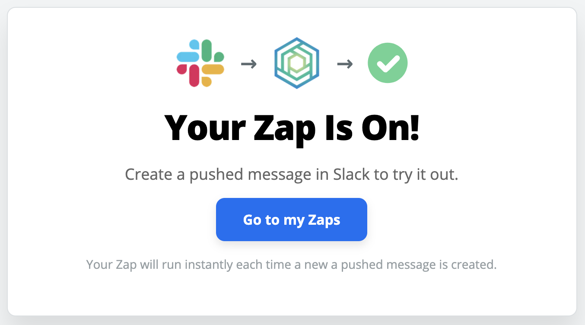{width="1.780702099737533in"
    > height="0.9890737095363079in"}
    > 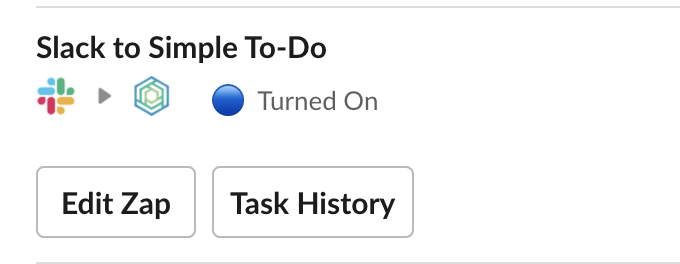{width="2.491228127734033in"
    > height="0.9671828521434821in"}\
    > (Zapier) (Slack)

## Testing the Slack to Honeycode integration

To test that messages from slack make it as tasks in your Honeycode app
do the following steps:

1.  Send the this message: "Take a moment to celebrate" to yourself in
    > Slack:\
    > \
    > {width="5.226087051618547in"
    > height="0.5431747594050743in"}

2.  Now click on the three dots to expose the rest of the actions:\
    > 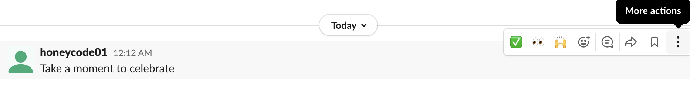{width="5.321738845144357in"
    > height="0.6732250656167978in"}\
    > \
    > And choose Push to Zapier from the menu that appears:\
    > \
    > 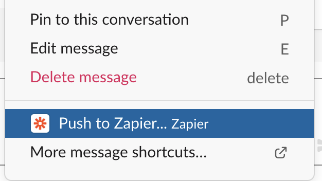{width="1.5913035870516186in"
    > height="0.8947911198600175in"}

3.  Choose the Zap you want to execute, namely "Slack to Honeycode
    > TO-DO" and click "Push"\
    > \
    > 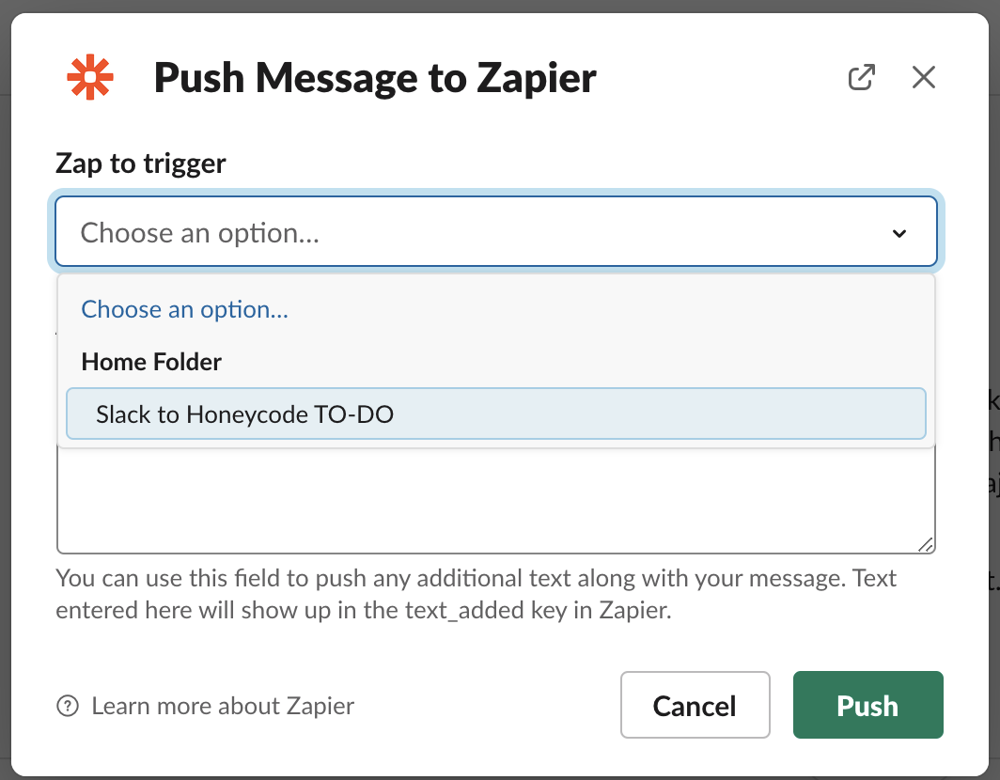{width="2.2962707786526684in"
    > height="1.7913046806649169in"}

4.  On the Slack side you will see that it triggered the Zap, like so:\
    > \
    > 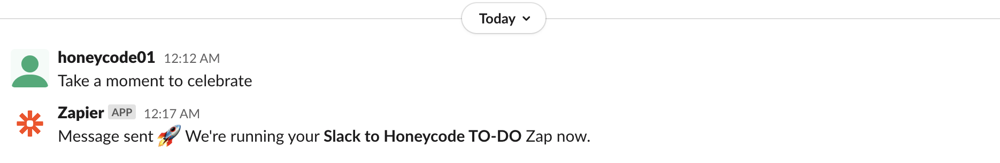{width="5.13043416447944in"
    > height="0.8396336395450569in"}

5.  In the "Simple To-Do" app you can look at the "Tasks" table and you
    > will see two rows appended at the end, one with the test message
    > and the other with the message we used in this final integration
    > test:\
    > \
    > 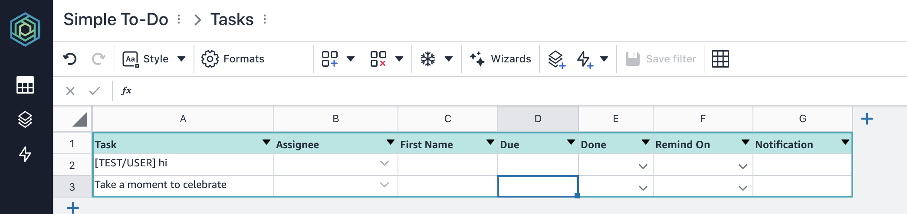{width="6.0in"
    > height="1.4180555555555556in"}

Happy pushing your Slack messages into Honeycode. Feel free to
experiment.

This concludes the Labs for Amazon Honeycode. 
