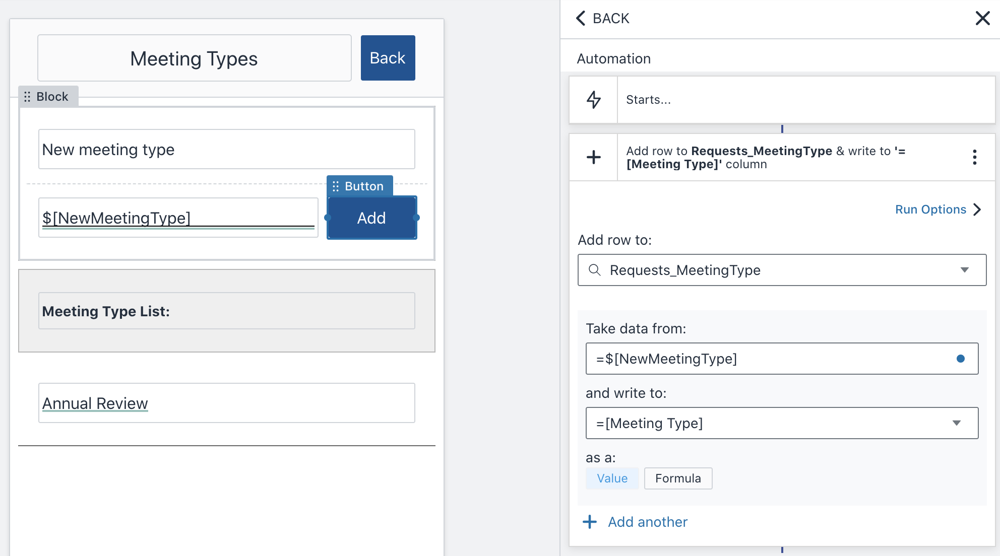

# Amazon Honeycode Role Based Access Controls (RBAC)

## Table of Contents {#table-of-contents .TOC-Heading}

[Overview 3](#overview)

[How does Access Control help me? 5](#how-does-access-control-help-me)

[Out of the Box Access Controls 6](#out-of-the-box-access-controls)

[Teams 6](#teams)

[Workbooks 8](#workbooks)

[Applications 9](#applications)

[Personalization 10](#personalization)

[Custom Role Based Access Controls (CRBCs)
11](#custom-role-based-access-controls-crbcs)

[Pattern 1 -- Hiding and showing data
11](#pattern-1-hiding-and-showing-data)

[Pattern 2 -- Row Level Security 14](#pattern-2-row-level-security)

[Pattern 3 -- Assignees based on template
18](#pattern-3-assignees-based-on-template)

[External Actors 18](#external-actors)

#  {#section .TOC-Heading}

## Overview

Amazon Honeycode is a fully managed service for customers to quickly
build powerful mobile and web applications with no programming required.
It helps solve team sized collaboration, and process improvement
challenges without any coding.

In the collaboration applications you build, access controls are crucial
not only in keeping data from falling into the wrong hands but will also
give your application a custom experience and will make your life as a
builder easier. For the purposes of this lab we will pretend we are
managing content on a newspaper website in Honeycode. We have Editors
who approve content, Authors who create content, translators, and even
....

Everyone's life would be much easier if we did not manage this process
through a massive spreadsheet, but a simple app where everyone was able
to easily go in and get their job done based on their role.

In this lab we will cover the out of the box Honeycode controls for
managing access, custom data level access controls, and will give a hint
at working with actors outside of our organization.

Warning: Please also check with your security officers and team to
ensure the controls you have put in place are sufficient for your
organization and use case. Honeycode falls under the shared security
model, and while Honeycode has passed AWS' stringent security reivews,
when it comes to security and data protection we recommend....

Specifically, you will:

-   Learn how to effectively use macro level controls: Teams, Workbooks,
    Apps and Sharing capabilities -- in Honeycode to protect data and
    make your life easier.

-   Understand Built in Personalization capabilities

-   Understand how to build granular access controls at the row level,
    with Custom Role Based Access Controls (CRBACs)

-   What to consider when exporting data to third parties

Pre-requisites:

1.  Free tier, Honeycode account. If you don't have one signup here:
    <https://builder.honeycode.aws/auth/signup>

2.  Recommended familiarity with introductory concepts in Honeycode,
    such as creating tables, filters and screens from scratch.

Format Conventions:

**Create Account**: Actions in the screen, like buttons or toolbar
elements.

My Drive: references to text or non-actionable elements in your screen.

"Tasks": reference to text that the user has to input in the screen.

FILTER: Inline code, keywords or formulas.

## How does Access Control help me?

Here are some reasons why access control is important, and why it can
help you to know how to apply these patterns in Honeycode; some are
obvious and some may surprise you:

**Data Protection** -- keeping data out of the wrong hands. Not just out
of potentially malicious outsider's hands, but even within a company or
a team not everyone is entitled to see all the data all the time. For
example, an interviewer should see their own interview notes but not the
entire list of interviewees or their personal data.

**Customized Permissions** -- permissions based on your organization.
With Honeycode apps you can give approval permissions to Managers,
Editors, Approvers, Publishers, or whatever else you call them in that
specific process.

**Personalize Work** -- showing users only what they need to see. Even
if the app can manage thousands of projects, each user will only be
responsible for a handful, and will update one at a time based on their
role.

**Simplified Interfaces** -- less data is easier to consume. Customers
are choosing simple custom applications because their spreadsheets are
getting too large to be useful.

**Easier to develop and maintain** -- fewer apps and screens you have to
create and maintain. Customizing a list, to only show items ready for
translation, for a translator, and ....... list to only show Normally
you would create an app for approvers and one for data entry folks,
often the lists are the same, why not combine them in one app and simply
manage the lists based on role.

## Out of the Box Access Controls

In this section we will cover Honeycode Teams, Workbooks, Apps and
Sharing; and how they can be used as macro level controls to protect
data. These controls create effective boundaries and help you protect
your data, when used as intended. More granular controls, at the row
level, are discussed in the next section.

### Teams 

Here are the key characteristics to keep in mind about Teams in
Honeycode:

**A team is a container.** It is a hard boundary around a number or
workbooks and users. The workbooks cannot be moved out, and can only be
shared with users in the team where the workbook lives. Billing is also
calculated at the team level. See our pricing page for more details.

**Users are either Admins or Members** -- Administrators, in Honeycode
named Admin, can invite other members to the team, and promote a member
to Admin. Admins cannot see all the workbooks or data, they can still
only see the workbooks and apps shared with them. This allows the
Administrative function to be separated from the actual data and usage
of Honeycode.

**Joining a team is by invite only.** Honeycode allows you to invite,
via email, other members to your team. Once they receive and accept the
invitation, they become part of the team. A user can leave a team, or
can be removed by the admin, and loose access to the workbooks, apps,
and data in a given team.

The ability to invite users to a specific team is limited to Admins by
default. However, an Admin can change the team settings to allow others
to invite. Invitation powers can be given to Only Admins, Admins and
members, or to Admins and specified members. We recommend using the
first and third option and giving special training to those who have
ability to invite.

{width="3.013792650918635in"
height="1.7693153980752405in"}

**A Honeycode user can be in several teams.** With one email address,
for example <mary@example.com>, you can be invited to multiple teams.
This means you can use and build applications for several work groups or
business teams, but the workbooks and workbook sharing do not cross the
team boundary. This also means that for billing purposes you will be
counted twice -- once in each team.

{width="2.9310345581802273in"
height="1.6283530183727035in"}

We recommend creating new teams when the data is highly sensitive (such
as HR data), or when you cannot trust those whom you have shared a
workbook or app to not share it with others in the team. See more about
app and workbook sharing below.

**A team can be email invite based, or Single Sign On (SSO) based**. An
alternative to inviting users via email to a team is Single Sign On
(SSO). In the case of email teams the list of email addresses is the
source of truth for who is a user in a given team. In the case of SSO
the authoritative list of users is a third-party system; an Directory
(Active Directory) or a third party provider (okta, onelogin, etc.). SSO
based teams are commonly found in Enterprises, where the large number of
users necessitates a centralized management of accounts and access.

It is important to note that a team can be either email based, or SSO
not both. Furthermore, a company domain, such as example.com can use
either email or SSO based teams but not both. Once a domain has been
verified for SSO purposes all logins will be forwarded to SSO based
teams. Migrating a team from email-based to SSO is manual today, one
workbook at a time, so plan carefully ahead. Technically, from Honeycode
perspective one type of team is not better than another; it is the
organizational requirements that will dictate which team you'll want to
setup.

### Workbooks

**All the work in Honeycode gets done in a workbook.** Each team is a
container of workspaces, called workbooks in Honeycode. Each user can
create as many workbooks as they want in a given team. You will usually
create a workbook, for a given business need, such as Time Tracking, or
Annual Review, or Purchase Order Approval. You would not want to put
recruiting and time tracking in the same workbook. In a workbook you
will create the data tables, the interfaces and the automations to
support that business process.

Once you decide which team to place it in and it cannot be moved from
that team except by opening a support case with the service team. A
feature to allow move or copy of workbooks is on the Honeycode roadmap,
but no due date is available at this time.

**Share workbook with a handful of people.** The users you share a
workbook with have the same privileges and capabilities that you do. If
you can see all the data in the tables, edit automations and create
screens so can they. By sharing a workbook, you have essentially given a
user "builder" level access and they can see or break any part of the
app you've built. It is recommended that you share the workbook only
with those who will develop or maintain the application itself; and
certainly not with everyone in the team.

**A workbook or app is not visible to others till it is shared with
them.** This includes Team Admins. They cannot see all the workbooks or
apps in the team. There is no charge per app or per workbook so it does
not matter how many there are. A user in the team can be either an Owner
or a Contributor in a given workbook. The owner and collaborator are
equal in what they can do with or inside a workbook, except the
Contributor cannot delete a workbook.

**Workbook copies are not shared.** A copy of a workbook (via the
Duplicate button) is not shared with anybody, not even the original
owners or collaborators of that workbook -- you will have to re-share
it. This is of great benefit when you want a snapshot of the workbook
for backup purposes or for experimenting, without bothering all the
other users.

**Changes are propagated immediately.** Any changes to workbook, apps
and automations (such as: table names, column names, data in the tables,
edits to screen, etc.) are immediately propagated to the rest of the
users. It is a very powerful feature in Honeycode, everyone is working
off the latest version at all times. However, it is important to
introduce changes carefully and experiment in a copy of the workbook or
a copy of the app. We have another workshop which we will give that
talks about best practices for managing and improving applications; stay
tuned on our announcements page on honeycodecommunity.com.

### Applications

Here we are talking about sharing applications with other users, not
builders.

While tables and automations are also part of a workbook, we have made
the case that the workbook should only be shared with a few builders.
When you share a workbook all tables, automations and applications are
shared and can be seen and edited by the builders with whom you share.

**A workbook many applications** -- A workbook can contain many
applications. You may want, for example, to have an application for
managers and one for individual contributors. Or, in the case of an FAQ
business case for example, you may want to have a read only application
that can be shared widely within the team, vs. an editor and approver
application.

The downside of creating several applications is that you have to
maintain multiple screens. It is recommended to create multiple
applications only when the use cases are drastically different and the
applications do not share the same screens. Or if you need to satisfy a
security team requirement that you cannot satisfy with personalization,
filtering, or hiding data, as we will describe later.

**Sharing only within the team** -- Application sharing is also limited
to the team where the workbook is placed. However, sharing cannot be
blocked within the team. For example, if I share an application with
Mary, she can turn around and share it with John. This is great because
it makes the application easily accessible to others in a team, but it
can be dangerous if I cannot trust Mary to not share the application
with anybody else.

If you have data that is very sensitive, or you cannot prevent sharing
by simply asking then you may want to consider creating a separate team,
creating the app in that team, and only inviting those who should have
access to the data. Human Resources, Intellectual Property, Legal,
Customer Personally Identifiable Information and other type of data may
fall into this category.

**Not visible till they are shared** -- an application once created from
scratch or duplicated is not visible to everyone. It is only visible to
the owners and collaborators at the team level. This is great because I
will want to make a copy of the app to test a new screen, or change the
way a screen behaves without disrupting the application used by everyone
-- the production app. This also helps me create a next version of the
app, with some improvements; and roll it out when I'm happy with it.

It does mean that I have to re-share with individuals, one by one, but I
can get others to help me share it widely within the team. There is no
capability to "share with all" at the moment.

That covers the macro level Access Controls, next we will look at how we
can control data at the individual row level. We will look at
Personalization and at building roles and filtering and hiding data
based on those roles.

## Personalization 

Let's say I want to build a simple Time Off requesting application, and
I want to list of my requests, and if I'm a manager I should see a list
of the requests I need to approve.

Let's say that I am user Honeycode 1 in this example. I'd start with a
very basic table like the one below, and I'd be the approver for my
other team mates (ag, bg, and hm). At the same time I'd report to "jh"
so he would be my approver.

{width="6.5in" height="1.6881944444444446in"}

Then, it by the power of personalization I can create two screens, one
to see My Requests, and one to see what I have to approve. Something
like this:

{width="2.227586395450569in"
height="2.2522976815398077in"}
{width="2.0827580927384077in"
height="2.2472222222222222in"}

Both of these pull data from the exact table, different fields of
course. The only difference is that one is personalized with "me" the
application user as the Requester and one as the Approver. Like so:

{width="1.7103444881889764in"
height="2.4638538932633423in"}
{width="1.7655172790901137in"
height="2.4777077865266843in"}

Voila, very quickly, with No Code, I have created screens for two user
types within the same application. I did not have to create an
application for entering and one for approving time off requests.

The problem comes if I need to have a backup for my manager, when she
goes on vacation I'd like someone else to approve my time off requests.
So, I add an "Alternate Approver" in my table, and expand my
personalization to show my request to the Approver OR the Alternate
Approver.

This approach works well for a use case like this, but it does not scale
well if I have use cases with dozens of people in a role or a group, or
if I have many different groups. I don't want to keep adding primary
secondary columns for Operations Manager, Crew Leads, Billing team, etc.
I will run into very wide tables and will eventually run into the 99
column per table limit.

## Custom Role Based Access Controls (CRBCs)

We will cover several patterns here getting from very simple to more
complex. At the core all of these patterns, just like personalization
have to do with showing or hiding data. However, we will want more than
just a name, we will want a role to determine what data or actions one
can see or use.

### Pattern 1 -- Hiding and showing data

(to a list of administrators)

Let's say I built the app for a set of Executive Assistants who manage
hundreds of meetings with several executives. We want to give the EA's
the ability to manage the types of meetings that can be scheduled. If we
don't give them a screen to do this they will always bother us to add
one more meeting type.

Also, we don't want to create another app just for this small use case,
we want it done within the same app. This data is not sensitive.

I'd start with two very basic tables. One for meeting requests and one
for the Administrators, let's call that one Permissions.

{width="3.1655172790901136in"
height="1.233740157480315in"}
{width="3.1375218722659666in"
height="1.1075185914260717in"}

There would, of course be a screen to list the meeting requests. At this
point this screen would show all the meeting requests.

I'd would also create a screen where EA's can add new meeting types.
Very simple screen, simply adds a row to the Requests_MeetingType table
that was auto created. In the Navigation I would hide this screen
because I don't want anybody to see it, except those listed in the
Permissions table, namely the Executive Assistants who manage this
process.

{width="3.379309930008749in"
height="1.8802821522309712in"}
{width="1.626061898512686in"
height="1.9793099300087489in"}

I might also create a Help screen where anybody can find out who to
contact in case they have problems with the app. And on the same screen
I would hide a link to the Meeting Types screen. This would only be
visible by EA's listed in the Permissions table.

The hiding of this Administrator Functions screen is based on the
Display property of the block. The Block will only display if the
formula in "Set visibility:" evaluates to true.

{width="4.655172790901138in"
height="2.0306703849518812in"}

I would replace this formula with one of the following:

=\$\[SYS_USER\] IN Permissions\[Actor\]

Or

=FILTER(Permissions,"Permissions\[Actor\]=%",\$\[SYS_USER\]) \> 0

Both do the same thing, they test to see if the current user, given by
the special variable \$\[SYS_USER\] is an Actor in the Permissions
table. We will expand on the second version in later examples as it is
more expressive.

You can also add an Approval button on the Meetings Request list, and
make it visible only to EAs listed in the Permissions table. The Display
formulas would be exactly as above.

**One note of caution.**

Hiding links, buttons or data fields on the screen does just that, hides
the data. It does not prevent it from being sent to the screen, it just
hides it on the screen. The application is still locked down and only
available to those with whom it was shared from within the team (two
levels of security already in place). However, the data is sent to the
screen/browser so it is technically possible to view bowser source and
see the data, link or button.

Therefore, this is powerful access control pattern is recommended only
for convenience, when no sensitive data is to be released to the wrong
team members. One can create two applications in the same workbook and
only share one with those who have admin privileges, or one can use
FILTERING to ensure data is only shown to the right audience.

Filtering retrieves data from the table, so it will only retrieve the
data that matches the role of the user, therefore sensitive data does
not make it to the screen/browser. We will discuss this pattern next.

### Pattern 2 -- Row Level Security

In this scenario, let's say you had many projects and you needed to
differentiate between leads, individual contributors and project owners.
Everyone's view was limited to the projects they were assigned to, big
security step 1, but we will also use Pattern 1 to allow different
actors to do different things within a given project.

We will also allow the user to customize the names of the roles with
levels.

We would really like to avoid at all cost the scenario below. Adding
multiple owners, leads, contributors from various departments each with
a separate column. Technically this can be done but it is so painful if
you have to add one more Legal Aid, or a project has 3 contributors and
you only have two fields. The rules also get so complicated; you end up
using "Owner 1 OR Owner 2 or Owner 3 OR Legal Aid 1 ...." Finally, if
you build screens based on this scheme you are in big trouble, every
time you need a new actor you have to change the screens and rules
everywhere.

{width="6.5in" height="1.2784722222222222in"}

Luckily there is a more elegant way, row level permissions based on
roles. At the core we will manage access to Projects, so a Projects
table is needed. But we will also create a Roles and a Contributors
table.

Let's start with roles. The roles table will be used as a pick list, and
we will assign each Contributor a specific role on a given project.
We've also added a Level designation to each role. This allows us to
name the roles whatever the business teams need, and simplify the access
to the various levels needed by the app. Often times, it turns out that
two roles need the same level of access within the tool but it is
important to see both roles on a project. For example, the Project owner
and the Project Manager have the same "power" in a project yet they are
two different people/roles often times.

The Contributors table, is a many-to-many-to-many mapping table. It
allows us to assign any contact from our team, to a project with a given
role. In this table Person is a "Contact" type, Project is a row link to
projects table, and Role is a rowlink to Roles table.

{width="2.1225809273840768in"
height="1.6911220472440944in"}
{width="2.974194006999125in"
height="1.6577318460192476in"}

Now our projects table will look quite different. We will have separate
summary for Owners, Leads and Contributors (the three levels available
in the Roles table).

{width="5.987096456692913in"
height="1.8978324584426947in"}

The summary columns are nothing but filters, showing the number of rows
that match from the Contributors table. The idea is to pull all the
contacts that are given a specific role for that project. The formulas
for these three columns are as follows:

Owners:

=FILTER(Contributors,\"Contributors\[Project\]=% AND
Contributors\[Role\]\[Level\]=%\",THISROW(),\"Owner\")

Leads:

=FILTER(Contributors,\"Contributors\[Project\]=% AND
Contributors\[Role\]\[Level\]=%\",THISROW(),\"Lead\")

Contributors:

=FILTER(Contributors,\"Contributors\[Project\]=%\",THISROW())

Now, on a projects list screen, we can use these roles to show only the
projects where I, the user of the app, am a Contributor. Or we can give
edit privileges to critical dates to Owners while others can edit all
the fields.

First the filter:

To show only the projects that I (current user, aka. \$\[SYS_USER\]) am
a contributor I'd change the Data source for the list to this formula:

=FILTER(Projects,\"\$\[SYS_USER\] IN
Projects\[Contributors\]\[Person\]\")

{width="5.316128608923885in"
height="2.5086909448818897in"}

**Hits:** We are simply replacing here the table as a source with a
Filter. The filter returns a subset of the table's rows, specifically
the ones that meet the criteria. Personalization does the same thing but
using a filter we can expand personalization to roles.

Now the display changes:

And if I wanted to make the Start Date editable only to Owners (but only
if the project has not been Approved), I would put this formula in the
Display attribute of the Start Date field. Please note that I'd have two
copies of the same field, one editable and one not editable. The formula
will simply toggle one and hide the other.

In the editable field (and therefore only editable by Owners):

=AND(\$\[SYS_USER\] IN
\$\[InputRow\]\[Owners\]\[Person\],\$\[InputRow\]\[Status\]\<\>\"Approved\")

In the non editable (and therefore visible by all):

=NOT(AND(\$\[SYS_USER\] IN
\$\[InputRow\]\[Owners\]\[Person\],\$\[InputRow\]\[Status\]\<\>\"Approved\"))

**Hints:** It is important to make these formulas mutually exclusive.
The word NOT is one easy way to do this. It is also recommended to not
make excessive use of these formulas in lists as they can be expensive
and will hurt performance; instead use them on display screens where
only one record is shown at a time.

{width="5.9741940069991255in"
height="3.10836832895888in"}

Now we have shown two powerful tools to limit the projects list,
securely, to only those assigned to a project. And once on that project
to give access only to some roles to edit certain data, or press some
buttons.

This pattern can also account for Pattern 1. We can do away with a
separate Admins list and simply add an Admin level. For example, we
could add Program Managers, who are part of our PMO office and can see
all the projects in the system, as well as edit Project Types or perform
other administrative functions. This takes the lead off the builder and
creates a more self-service app.

Here are the additions to the Role and the Contributors tables. Notice
no structural changes to add a new role.

{width="2.103226159230096in"
height="0.23208005249343833in"}
{width="3.248669072615923in"
height="0.21935476815398075in"}

The formula for the help screen would be:

=FILTER(Contributors,\"Contributors\[Person\]=% AND
Contributors\[Role\]\[Level\]=%\",\$\[SYS_USER\],\"Admin\")\>0

### Pattern 3 -- Assignees based on template 

But there are two problems that arise: a) adding manually each
contributor to a specific project can be tedious, b) what if I want to
have different contributors for different kinds of projects.

The way to resolve both of these problems is with a template, of sorts,
for each type of project. We will create a list of users (and their
roles) to be assigned to each project type, by default. At the creation
of a project we will copy the assignees from the template to the actual
project, based on the type of project chosen.

We will cover this in detail in the templates workshop, stay tuned.

## External Actors

Data can flow to and from third party systems and external actors.
External here means, outside the team where the app resides. Honeycode
is not a data island, there are ways to move data in and out. Here we
will highlight some important points to know about these integrations to
help you and your organization safeguard the data.

**RESTful APIs**. There are 12 APIs that can be called from AWS Lambda,
AWS CLI, AWS SDK, command line CURL or your custom code. They do require
AWS Version 4 signature like most AWS APIs. We recommend using the CLI
or the SDK because they implement the signature out of the box. You can
run a command like this from the CLI to list the tables in a workbook if
you have your credentials setup for the CLI, and your Honeycode account
is linked to your AWS Account:

\% aws honeycode list-tables \--workbook-id \[workbook id required\]

You can learn more about the APIs here:
<https://docs.aws.amazon.com/honeycode/latest/APIReference/Welcome.html>

**Linking to AWS Account** -- Linking is a very simple process. On the
team page, if you are an Administrator, you can click "Connect" and
enter an AWS account ID. In the AWS account search for the Honeycode
service and you will see the connection requests. Here you accept the
connection. Accepting the connection not only allows you to upgrade to
higher paid tiers but allows you to use the Honeycode APIs.

{width="1.7096773840769903in"
height="1.0004221347331583in"}
{width="4.509677384076991in"
height="1.0031146106736657in"}

Fig a. Honeycode Team Fig b. AWS Account Accept Connection

Once linked you can also enable SSO from the AWS Account page for
Honeycode.

It is important to know that you will need to file a support case to
unlink a Honeycode account from AWS Account.

**Zapier,** is a third party SaaS integration platform. Honeycode is
integrated as a destination (not a trigger), at this time, within
Zapier. You can take data from a third party app and move it into
Honeycode. For sending data to Zapier see Webhook discussion below.
Zapier does not require an AWS Account linking to work with Honeycode,
all you need is a Honeycode Admin account to setup the relationship.

**AppFlow**, is an AWS SaaS integration platform. Here Honeycode is also
integrated as a destination, at this time. For AppFlow you will be
required to use an AWS Account ID.

**Webhooks** -- Honeycode can call HTTPS webhooks. Webhooks can be
called to send data out to Zapier, APIGateway or another HTTPS endpoint
on the web. It does not require an AWS Account ID, so any builder (not
user) can call a webhook. Please ensure you use a HTTPS webhook for
security in transit, and make sure to authenticate the webhook with a
pre-shared key or secret in the header of the request (not URL based
query parameter).

**Email** -- The default Notification action within Honeycode only
allows you to send an email notification to members of the team where
the app resides, it does not send email externally to any email address.
It is possible using APIs or Webhook to send data to an email service
and therefore externalize data via email.

Appendix

Most Secure (security measures)

-   AWS Security of the Service itself -- AWS does its part to audit

-   APIs -- useful for sharing data with other systems or third parties
    within AWS and outside -- APIs not available unless you link to AWS
    Account

-   Team invite -- any data or apps only shared within the team --
    useful for sensitive data

-   Separate workbooks -- differing projects or business cases, where
    you trust people to not share apps with those who should not have
    access to it

-   Separate apps -- for distinct roles within a business case (manager,
    vs individual contributor)

-   Filtering or Personalization -- pulling data based on user name or
    role -- for separating

-   Hiding/Showing data -- on the screen based on user name or role --
    for convenience if data is not sensitive or all actors are roughly
    at privilege level with respect to the data hidden.

Least secure
